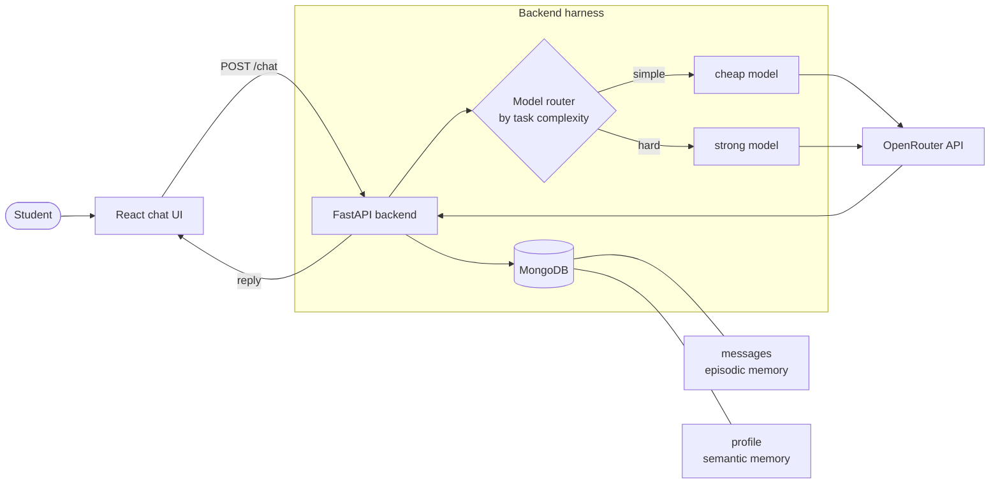

# Architecture

## The moving parts



## Request lifecycle (what happens on one message)

1. Student sends a message from the React UI to `POST /chat`.
2. Backend loads the **learner profile** (semantic memory) and recent
   **messages** (episodic memory) from MongoDB.
3. Backend builds the working context: system prompt + profile facts + recent
   turns + the new message.
4. The **router** picks a model based on how hard the task looks (see table).
5. OpenRouter returns a reply.
6. Backend saves both messages to `messages`, then (sometimes) asks the
   **summarizer subagent** to update `profile`.
7. Reply goes back to the UI.

This mirrors the "working memory / context RAM" plus "harness loop" from the
lecture, kept deliberately small.

## Model routing (M2)

The point is not which models. The point is that a harness *chooses*.

| Task looks like | Tier | Example OpenRouter slug (confirm current on openrouter.ai) |
|-----------------|------|------------------------------------------------------------|
| greeting, recall, yes/no | cheap | `meta-llama/llama-3.1-8b-instruct` |
| explain a concept | mid | `google/gemini-2.5-flash` |
| generate a quiz, judge an answer | strong | `anthropic/claude-sonnet-4.5` |

> **These slugs are examples and go stale.** Models get renamed and retired, so
> a slug that worked when this doc was written may 404/400 later. Before you rely
> on a tier, confirm the slug is live (a quick call, or `GET /models`). A slug
> OpenRouter rejects must surface as a clean error, not a crash - see "never fail
> silently" below.

Routing rule for the demo can be as dumb as keyword or message-length based.
Keep it honest and simple; say "a real system would classify intent here."

## Tech stack

- **Frontend:** React (Vite), a single chat component.
- **Backend:** FastAPI, one `/chat` route to start.
- **Store:** MongoDB, two collections: `messages`, `profile`.
- **Models:** OpenRouter (one API key, many models).

## Data model (keep it this small)

```
messages:  { _id, role: "user"|"assistant", text, ts }
profile:   { _id, facts: [ "studying algorithms", "weak on recursion" ], updated_ts }
```

## Config and secrets

- `OPENROUTER_API_KEY` in `backend/.env` (never committed; `.env` is gitignored).
- `.env.example` documents the keys with no real values.

### MongoDB: local or Atlas (read before writing `db.py`)

`MONGODB_URI` may point at **either**:

- **Local** (`mongodb://localhost:27017`) - the documented default; no TLS.
- **Atlas / cloud** (`mongodb+srv://...`) - a hosted cluster; TLS is mandatory.

The Atlas path has one macOS gotcha: the stock Python has no system CA bundle,
so `mongodb+srv` TLS fails with `CERTIFICATE_VERIFY_FAILED` and the whole
`/chat` request hangs then errors. **Always** create the Mongo client with an
explicit CA bundle so both paths work:

```python
import certifi
from pymongo import MongoClient
client = MongoClient(MONGODB_URI, tlsCAFile=certifi.where())
```

`tlsCAFile` is ignored on a non-TLS local connection, so this one line is safe
for local Mongo and required for Atlas. Pin `certifi` in `requirements.txt`.

## Frontend: never fail silently

The chat component must wrap its `POST /chat` call in `try/catch` and render the
error (a visible "could not reach StudyPal" line), not swallow it. A backend
that hangs or 500s should show *something* in the UI, otherwise a broken
request looks like an empty chat with no clue what went wrong.

The backend must cooperate. `/chat` should wrap the model call and, on any
upstream failure (bad slug, timeout, OpenRouter 4xx/5xx), return an
`HTTPException` (e.g. `502` with a JSON `detail`) - never let the exception
escape as an unhandled `500`. FastAPI's CORS middleware does **not** add headers
to unhandled-exception responses, so an unhandled `500` reaches the browser
without CORS headers, gets blocked, and the fetch rejects as a generic
`Failed to fetch` - the frontend's `try/catch` then has nothing useful to show.
A clean `HTTPException` goes through the normal (CORS-wrapped) path, so the UI
can display the real reason.

## Frontend look & feel (visual baseline)

A student should clone the skeleton, run `/feature M1`, start both servers, and
see a chat that looks **intentionally designed**, not a raw browser default. The
UI is small, so a little styling goes a long way. This baseline is a requirement
for any feature that touches the UI, starting with M1.

**Ground rules (keep it dependency-free):**

- Plain CSS in one file, `frontend/src/index.css`, imported once in
  `src/main.jsx`. **No** Tailwind, no component library, no downloaded web
  fonts - so it works offline and adds nothing to install.
- Define **design tokens** as CSS custom properties on `:root` (colors, spacing,
  radius, font, shadow). Put the brand accent in a single `--accent` variable so
  the whole app is re-themed by editing one line.
- Use the **system font stack**
  (`-apple-system, BlinkMacSystemFont, "Segoe UI", Roboto, sans-serif`), never
  the default serif.

**Layout:**

- One centered column, `max-width` ~720px, filling the viewport height with
  flexbox: a **sticky header** (the "StudyPal" title + a one-line tagline), a
  **scrollable message area** that grows to fill space and auto-scrolls to the
  newest message, and an **input bar pinned to the bottom**.
- Responsive down to ~360px wide (no horizontal scroll on a phone).

**Messages as bubbles:**

- User turns right-aligned in an `--accent`-tinted bubble; assistant turns
  left-aligned on a subtle surface background. Rounded corners, comfortable
  padding, readable line length.
- The role label and the `[tier · model]` tag are small and muted, not shouting.

**Controls & feedback:**

- Text input and Send button with clear `:hover`, `:focus-visible` (visible
  focus ring), and `:disabled` states. Disable the input/button while a request
  is in flight.
- Show a **"StudyPal is thinking…"** indicator while awaiting a reply, and style
  the error line (from "never fail silently") distinctly (e.g. a red-tinted
  bubble) so it reads as an error.

**Light and dark:** support both via `@media (prefers-color-scheme: dark)` by
swapping the token values - no separate stylesheet.

**Accessibility:** sufficient text contrast, a visible focus outline, and a
labelled input (`aria-label` or a `<label>`).

Keep it tasteful and minimal - this is a teaching demo, so favor a clean neutral
palette with one accent over anything busy. The point is that the generated page
looks finished on first run.

## Assistant messages are Markdown (render, don't dump)

The models reply in **Markdown**: bold, italics, `#` headings, numbered and
bulleted lists, fenced code blocks, tables, and `---` rules. The chat UI must
**render** that Markdown to HTML, not print the raw string. If you skip this,
the bubble shows literal `**`, `*`, `#`, and `---`, lists lose their indentation,
and code blocks run together. That "lots of asterisks and slashes, bad spacing"
look is the symptom of a chat that dumps raw text instead of rendering it. This
requirement starts at M1 (the first turn the UI shows) and holds for every UI
feature after it, including the M4 skills (`explain-simply`, `quiz-me`) whose
output leans heavily on lists and code.

**How to render it:**

- Render assistant turns with a small, well-known renderer: **`react-markdown`**
  plus **`remark-gfm`** (GFM adds tables, task lists, strikethrough). These two
  npm packages are the **one allowed dependency exception** to the
  "dependency-free" rule above - that rule is about CSS and web fonts, not about
  a tiny Markdown renderer. Add them to `frontend/package.json`; do not hand-roll
  a Markdown parser.
- Render Markdown for **assistant** turns only. **User** turns stay plain text
  (rendered as a string), so a student can't inject markup into their own bubble.
- **Do not** enable raw-HTML passthrough (no `rehype-raw`). `react-markdown`
  ignores embedded HTML by default; keep it that way so a model reply can never
  inject `<script>` or arbitrary markup.

**Style the rendered elements** in `frontend/src/index.css`, scoped under the
assistant bubble (e.g. `.msg-assistant`), so Markdown reads well *inside a chat
bubble* rather than like a full web page:

- Tight vertical rhythm: modest `margin` on `p`, `ul`, `ol` so consecutive
  paragraphs and lists don't gap open.
- Lists indent properly: give `ul`/`ol` a real `padding-left` (≈1.25rem) so
  nested items step in and bullets/numbers are visible.
- **Demote headings**: an `h1`/`h2` from the model must not render page-huge in a
  bubble. Cap rendered heading sizes to roughly bold-body / slightly-larger.
- Code: `code` (inline) and `pre code` (block) use a monospace stack on a subtle
  surface background with padding and rounded corners. `pre` gets
  `overflow-x: auto` so a wide code line scrolls inside the bubble, never widens
  the page.
- `hr` (from `---`) renders as a thin muted divider, not a thick black rule.
- Tables (from GFM) sit in an `overflow-x: auto` wrapper so a wide table scrolls
  inside the bubble.
- All of the above must theme with the existing light/dark tokens.

**One acceptance check for any UI feature:** send a reply containing a heading, a
numbered list, inline `code`, and a fenced code block, and confirm the bubble
shows *formatted* output (real bullets, real code box), with **no** literal `**`,
`#`, or `---` visible. If raw markers show, the feature is not done.

A related, cheaper lever: the M4 skill prompt files should ask the tutor for
**chat-friendly** Markdown (short paragraphs, modest heading levels, lists over
walls of text). Rendering is the fix for the raw-markers problem; sane prompting
just keeps the rendered result tidy.
